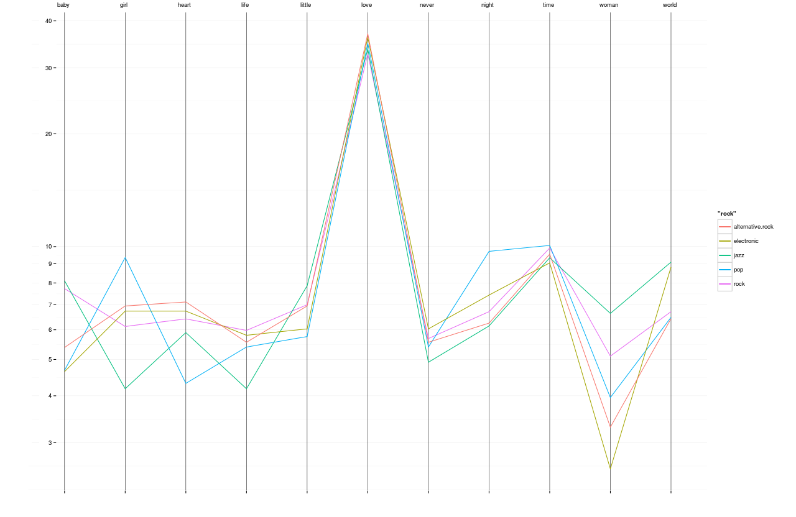

```{r, echo=FALSE, message=FALSE}
# Load data & libraris
library(dplyr)
library(ggplot2)

songs <- read.csv("~/git/analise-dados-2-p2/csv/songs.csv");
```

## Perguntas

**1. As músicas antigas são mais familiares?**


```{r, echo=FALSE}

data <- select(songs, artist_familiarity, artist_hotttnesss, duration, year);
data.with_year <- arrange(filter(data, year > 1960), year);
data.aggr <- aggregate(. ~ year, data=data.with_year, FUN=mean)

ggplot(data.with_year, aes(x = year, y = artist_familiarity)) +
  geom_point(alpha = 0.3, position = position_jitter(width = .3)) +
  geom_point(data = data.aggr, colour = 'red', size = 3) +
  xlab("Ano") +
  ylab("Familiaridade")
```

Analisando o gráfico percebemos que a *idade* de uma música não está relacionada com a familiaridade da mesma. Por outro lado é fácil perceber que a quantidade de músicas é bem maior no ultimos anos e contudo temos mais músicas em ambos os extremos.

**2. Quais são as palavras mais comuns nos títulos das músicas?**


```{r, echo=FALSE}
#term_word_proportion <- read.csv("~/git/analise-dados-2-p2/csv/term_word_proportion.csv")

#ggplot(data = term_word_proportion, colors=(distinct = T)) +
#  geom_line(aes(x = word, y = rock.p, group = 1, color="rock")) +
#  geom_line(aes(x = word, y = jazz.p, group = 1, color="jazz")) +
#  geom_line(aes(x = word, y = alternative.rock.p, group = 1, color="pop")) +
#  geom_line(aes(x = word, y = electronic.p, group = 1, color="electronic")) +
#  geom_line(aes(x = word, y = pop.p, group = 1, color="alternative.rock")) +
#  scale_y_log10(breaks=c(1,2,3,4,5,6,7,8,9,10,20,30,40,50), labels=c(1,2,3,4,5,6,7,8,9,10,20,30,40,50)) +
#  xlab(label = "") +
#  ylab(label = "") +
#  theme_bw() +
#  theme(
#    panel.border = element_rect(colour = 'white'),
#    panel.grid.major.x = element_line(colour = 'black', size = 0.25))
```

Podemos observar que a palavra **love** é bem comum nos títulos, independende do género.



3. Como o ano influencia na popularidade de um género?


4. As músicas estão ficando mais curtas?

5. Existe género que está morrendo, e o género que mais domina?

