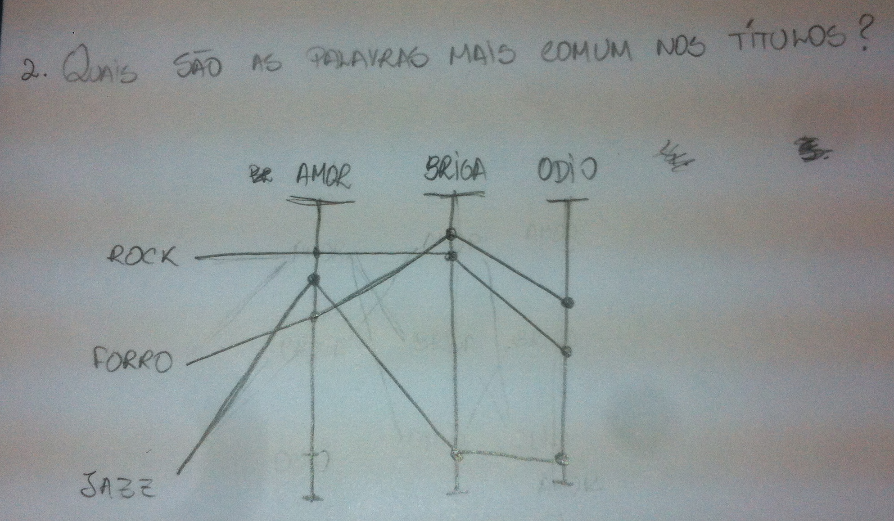

```{r, echo=FALSE, message=FALSE}
# Load data & libraris
library(dplyr)
library(ggplot2)

songs <- read.csv("~/git/analise-dados-2-p2/csv/songs.csv");
artist_term <- read.csv("~/git/analise-dados-2-p2/csv/artist_term.csv");

tmp <- arrange(filter(select(merge(songs, artist_term), term, title), term == "rock" | term == "pop" | term == "jazz" | term == "electronic" | term == "alternative rock"), term);
tmp$title <- tolower(tmp$title)

write.csv(tmp, file = "~/git/analise-dados-2-p2/csv/term_title.csv");

term_word_count <- arrange(read.csv("~/git/analise-dados-2-p2/csv/term_word_count.csv"), desc(total))
```

## Perguntas

* 1. As músicas antigas são mais familiares? *


```{r, echo=FALSE}

#data <- select(songs, artist_familiarity, artist_hotttnesss, duration, year);
#data.with_year <- arrange(filter(data, year > 1960), year);
#data.aggr <- aggregate(. ~ year, data=data.with_year, FUN=mean)

#ggplot(data.with_year, aes(x = year, y = artist_familiarity)) +
 # geom_point(alpha = 0.3, position = position_jitter(width = .3)) +
  #geom_point(data = data.aggr, colour = 'red', size = 6) +
  #xlab("Ano") +
  #ylab("Familiaridade")
```


2. Quais são as palavras mais comuns nos títulos das músicas?




```{r, echo=FALSE}

```

3. Como o ano influencia na popularidade de um género?


4. As músicas estão ficando mais curtas?

5. Existe género que está morrendo, e o género que mais domina?

